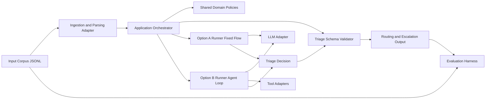
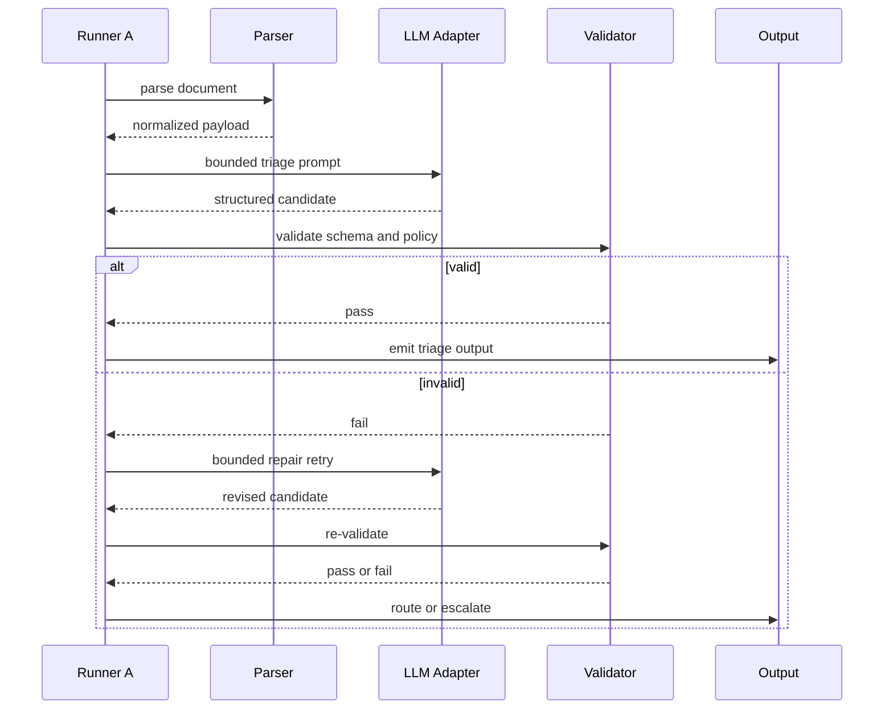
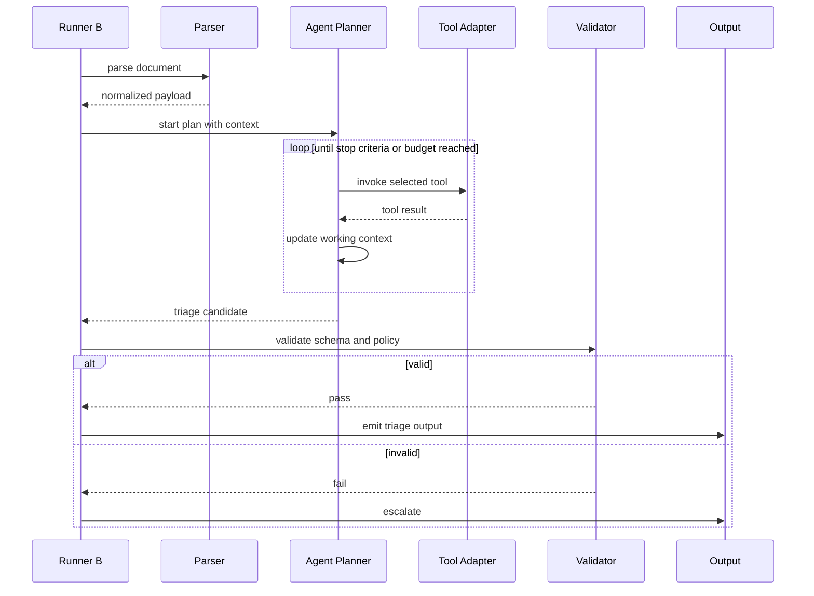
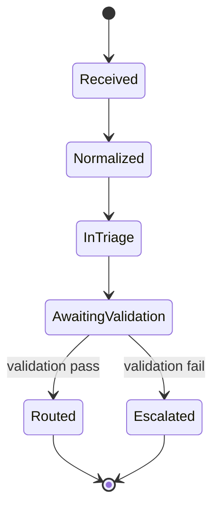

# Architecture — Agents vs Workflows

## Scope
This architecture covers the triage stage only:
- ingest customer document
- produce structured triage decision
- route or escalate

Downstream specialist resolution is out of scope.

## Key architectural decisions

### AD-01: Shared core, swappable orchestration modes
- **Decision:** Keep shared ingestion/schema/policy/eval components, swap only orchestration mode (A vs B).
- **Why:** Enables fair comparison and isolates the control-flow variable.

### AD-02: Ports-and-adapters at IO boundaries
- **Decision:** External interactions (LLM, retrieval, policy sources, persistence) go through adapters.
- **Why:** Keeps domain/application logic testable and provider-agnostic.

### AD-03: Schema-first contract at triage output boundary
- **Decision:** Both A and B must emit the same triage schema and pass the same validators.
- **Why:** Supports apples-to-apples evaluation and safer integration.

### AD-04: Guardrailed agent loop for Option B
- **Decision:** B uses tool allowlist, max tool calls, timeout budget, and mandatory final validation.
- **Why:** Balances adaptivity with predictable operational risk.

### AD-05: Deterministic evaluation harness
- **Decision:** Evaluate A and B on the same synthetic snapshot and shared metrics.
- **Why:** Prevents data drift from distorting architecture comparison.

### AD-06: Plain Python orchestration first, no LangChain/LangGraph initially
- **Decision:** Implement A/B runners with plain Python orchestration and adapter interfaces in the first build.
- **Why:** Keeps control flow explicit for architecture comparison, reduces framework overhead, and improves debuggability.

### AD-07: `pytest` + LLM eval harness (both required)
- **Decision:** Use `pytest` for deterministic checks and a corpus replay eval harness for behavior quality.
- **Why:** `pytest` validates code correctness, while replay eval validates model-driven outcomes.

## Technology choices
- Python 3.11 runtime
- `pydantic` for boundary schemas
- `pytest` + lightweight fixtures for component/integration tests
- JSONL corpus (`samples.jsonl`, `gold.jsonl`) for reproducible experiment inputs

No heavy orchestration framework is required initially; simple runners are preferred for clarity.

LangChain/LangGraph is deferred unless complexity triggers appear (checkpointing/resume, human-in-loop, or orchestration boilerplate dominating code).

## Component diagram

## Sequence diagram — Option A (fixed flow)

## Sequence diagram — Option B (dynamic flow)

## State diagram — Triage case lifecycle

## Build-time invariants
1. Same input corpus for A and B in each evaluation run.
2. Same output schema and validators for A and B.
3. No adapter dependency leakage into domain policy logic.
4. All triage outcomes include trace metadata for debugging.
5. Option B cannot bypass final schema/policy validation.
6. Every architecture change is evaluated with both deterministic tests and replay eval metrics.

## Evaluation architecture
Use two complementary layers:

1. Deterministic test layer (`pytest`)
- schema validation behavior
- routing/escalation policy behavior
- retry/budget guardrail behavior
- adapter contract behavior

2. Behavioral replay layer (LLM eval harness)
- run A and B on identical `samples.jsonl`
- score against `gold.jsonl`
- report both overall and slice metrics (doc type, edge case type)

Core metrics to track:
- doc-type classification accuracy
- queue recommendation accuracy
- escalation precision/recall
- missing-required-field detection recall
- latency and cost proxies (per-case and distribution)

## Risks to track
- Option B latency/cost drift under tool loops.
- Option A underperformance on ambiguous, mixed-signal cases.
- Hidden coupling between adapters and orchestration logic.

## What else to document as build progresses
- runtime config model (timeouts, budgets, retry caps)
- observability model (event schema, correlation ids)
- test strategy map (unit, contract, integration, replay)
- failure taxonomy with mitigation playbooks
- explicit framework adoption trigger review (when/if to introduce LangChain/LangGraph)
