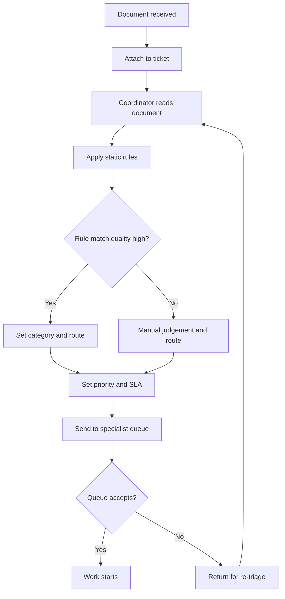
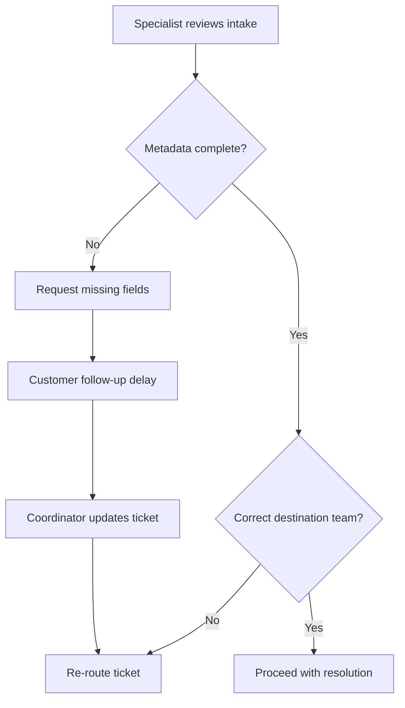

# As-Is Process and BPMs

This describes how document triage is performed today without LLMs.

## Process Summary
1. Intake receives new document and basic metadata.
2. Coordinator performs initial read and categorization.
3. Rule engine runs keyword and regex checks.
4. Coordinator adjusts priority and routing destination.
5. Ticket is forwarded to specialist queue.
6. Rework loop occurs if metadata is incomplete or routing is incorrect.

## BPM 1: Main Triage Flow

## BPM 2: Exception/Rework Path

## Observed Friction Points
- handoff delays between intake and specialists
- inconsistent triage decisions across analysts
- false positives from rigid keyword rules
- repeat rework caused by missing context fields
