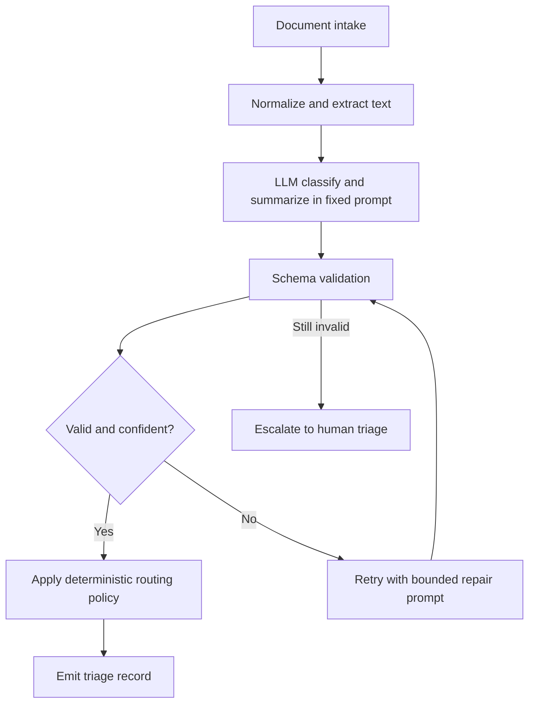
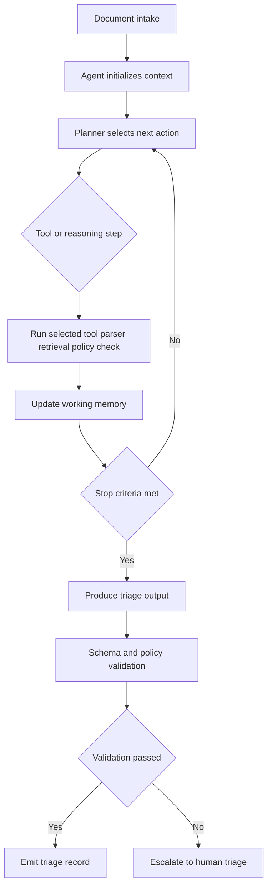

# LLM-Enabled Replacement, Designs A/B, and ADR

## Proposed LLM-Enabled Replacement
Introduce an LLM-centered triage service with strong controls, shared schema validation, and measurable quality gates.

### Core benefits expected
- better semantic understanding than keyword-only rules
- consistent output structure across diverse documents
- faster triage at high volume
- explicit uncertainty handling and escalation policy

### Shared components (used by both designs)
- canonical triage output schema
- document normalization/parsing layer
- policy constraints (PII, escalation, SLA classes)
- evaluation harness and experiment tracking
- audit log for decisions and intermediate evidence

## Design A: Workflow-Constrained LLM
LLM is used in bounded steps only; orchestration remains deterministic.

### Design A BPM

### Design A strengths
- predictable control flow
- easier testing and compliance review
- lower blast radius for model mistakes

### Design A limitations
- less adaptive to unseen document patterns
- tool usage and evidence gathering are constrained
- may require frequent prompt and rule maintenance

## Design B: Agentic LLM (Tool-Using)
LLM can choose tools and action order within hard safety limits.

### Design B BPM

### Design B strengths
- adaptive behavior for ambiguous or mixed-content inputs
- richer evidence collection using tools
- potentially higher recall on complex edge cases

### Design B limitations
- harder to reason about and test exhaustively
- larger operational and safety surface area
- latency and cost can drift without strict caps

## ADR-Style Comparison (First Principles)

## Decision Drivers
- reliability under SLA pressure
- error containment and safety
- performance on ambiguous inputs
- implementation complexity and maintainability
- observability and debuggability

## Option A: Workflow-Constrained
- **Reliability:** high due to bounded execution paths
- **Safety:** high due to limited action space
- **Complexity:** moderate and easier to operate
- **Adaptivity:** moderate to low

## Option B: Agentic
- **Reliability:** variable; depends on guardrail quality
- **Safety:** medium unless heavily constrained
- **Complexity:** high
- **Adaptivity:** high

## Initial Decision
Start with shared infrastructure plus both swappable execution modes, with workflow-constrained mode as baseline for production confidence.

Rationale:
- enables controlled comparison on common metrics
- reduces lock-in to a single architecture early
- allows agentic behavior to prove value on hard cases before broad rollout

## Experiment Execution Plan
1. Build synthetic document corpus in `data/` with realistic class imbalance and edge cases.
2. Implement shared ingestion, schema, and evaluation components.
3. Implement Design A and Design B behind a common runner interface.
4. Run paired evaluations and compare quality/latency/cost/rework proxies.
5. Publish findings and recommendation for next iteration.
