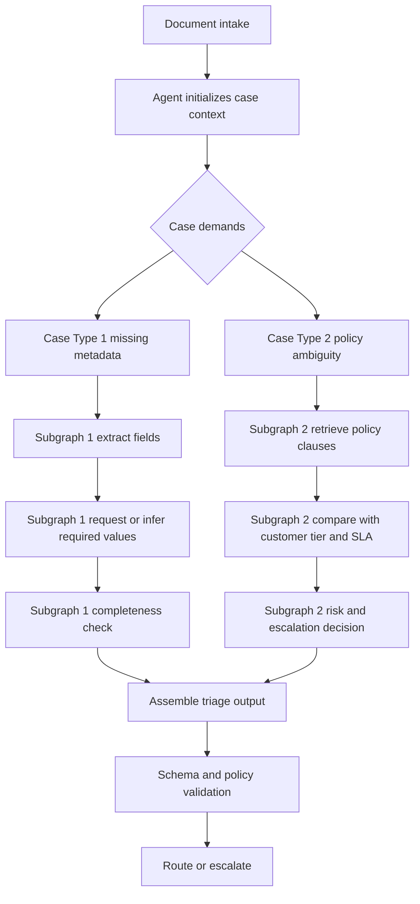

# Fieldnotes — Agents vs Workflows

## Table of contents
- [Finding 001: Core architectural distinction (design-phase)](#finding-001-core-architectural-distinction-design-phase)
- [Finding 002: Shared safety boundary is preserved across A/B](#finding-002-shared-safety-boundary-is-preserved-across-ab)
- [Finding 003: Agent mode outperforms workflow on this synthetic corpus](#finding-003-agent-mode-outperforms-workflow-on-this-synthetic-corpus)
- [Finding 004: Diversity of execution paths is now measurable](#finding-004-diversity-of-execution-paths-is-now-measurable)
- [Finding 005: Notebook rehydration/import reliability is resolved](#finding-005-notebook-rehydrationimport-reliability-is-resolved)
- [Implications and next experiments](#implications-and-next-experiments)

## Finding 001: Core architectural distinction (design-phase)
**Option A uses a fixed control graph; Option B uses a partially dynamic control graph.**

This remains the primary framing for the experiment.

- **Option A (workflow-constrained):** control flow is predefined and deterministic (with bounded retries).
- **Option B (agentic):** control flow can branch at runtime based on case context and tool outcomes.

### Why this matters
- It changes how we reason about reliability, testing, and governance.
- It changes how we reason about adaptivity on ambiguous documents.
- It changes where complexity lives: orchestration code (A) vs runtime policy/guardrails (B).

### Human-role analogy
- **Rote triage operator (A-like):** follows a strict checklist in a fixed order and escalates when inputs do not fit.
- **Empowered triage analyst (B-like):** chooses what evidence to gather next, consults references as needed, then makes a recommendation under policy constraints.

### Brief pros and cons
#### Option A (fixed graph)
**Pros**
- predictable execution and easier testing
- simpler operational controls
- strong auditability of path taken

**Cons**
- less adaptive on novel/mixed inputs
- can require prompt/rule maintenance churn
- may miss context that a dynamic evidence-gathering loop could catch

#### Option B (dynamic graph)
**Pros**
- adaptive evidence gathering and tool selection
- better handling of ambiguous/edge cases
- potential quality lift on complex documents

**Cons**
- higher control-plane complexity
- harder to bound latency/cost without strict caps
- broader safety and observability burden

### Case-dependent subgraphs in Option B
The agent does not run one universal checklist for every document. Different case types trigger different mini-workflows, while still converging to the same final validation and routing step.

## Finding 002: Shared safety boundary is preserved across A/B
**Both orchestration modes now converge on the same decision contract and fail-closed behavior.**

Evidence from core code:
- Workflow path uses bounded retries and explicit fail-closed fallback in `customer_doc_triage.workflow.pipeline.run_workflow`.
- Agent path uses guardrails (allowlist, max tool calls, timeout) and then same validation/fail-closed boundary in `customer_doc_triage.agent.pipeline.run_agentic`.
- Shared schema/policy scoring remains centralized in `customer_doc_triage.triage` and `customer_doc_triage.eval.metrics`.

Interpretation:
- We maintained fairness for A/B comparison by keeping output schema, policy validation, and fail-closed semantics common.

## Finding 003: Agent mode outperforms workflow on this synthetic corpus
**On the current 200-row synthetic run, agent mode has higher quality metrics with similar safety recall.**

Observed from notebook aggregate metrics and `eval_outputs/ab_eval_summary.md`:
- Workflow: doc type / queue accuracy = **0.915 / 0.915**
- Agent: doc type / queue accuracy = **1.000 / 1.000**
- Escalation recall: **1.000** for both
- Escalation precision: **0.2125** (workflow) vs **0.2576** (agent)
- Missing-field recall: **0.965** (workflow) vs **1.000** (agent)

Interpretation:
- Agent mode currently provides a measurable quality lift, especially on edge-like and ambiguous samples, while preserving full escalation recall.

## Finding 004: Diversity of execution paths is now measurable
**The A/B gap is not only quality; it is also structural behavior.**

Observed:
- Distinct step patterns: workflow **1** vs agent **3**
- Average tool calls: workflow **0.00** vs agent **3.465**
- Agent pattern A (107 cases): `detect_doc_type -> extract_metadata -> check_completeness` (mainly `billing_dispute`, `feature_request`, `security_questionnaire`)
- Agent pattern B (52 cases): `detect_doc_type -> extract_metadata -> check_completeness -> risk_scan` (`incident_report`)
- Agent pattern C (41 cases): `detect_doc_type -> lookup_policy_context -> risk_scan -> check_completeness` (`access_request`)

Interpretation:
- Workflow is a single fixed path; agent expresses controlled path diversity that responds to case context, matching the design hypothesis of case-dependent subgraphs.

## Finding 005: Notebook rehydration/import reliability is resolved
**Notebook execution is now robust to working-directory differences.**

Observed from notebook run output:
- Import setup confirms repo root discovery and `customer_doc_triage` source path availability.
- Notebook now executes through aggregate metric cells successfully in sequence.

Interpretation:
- The exploratory workflow is now reproducible for contributors without requiring prior editable install in all cases.

## Implications and next experiments
1. Keep promoting reusable orchestration/eval logic into `customer_doc_triage` core; keep experiment folders focused on variable-specific deltas and artifacts.
2. Add calibrated latency proxies (non-zero simulated/real timings) so runtime-cost trade-offs can be compared alongside quality.
3. Stress test guardrail behavior with targeted adversarial and policy-conflict slices.
4. Run a larger mixed corpus with harder ambiguous cases to verify whether the current agent quality edge persists.
