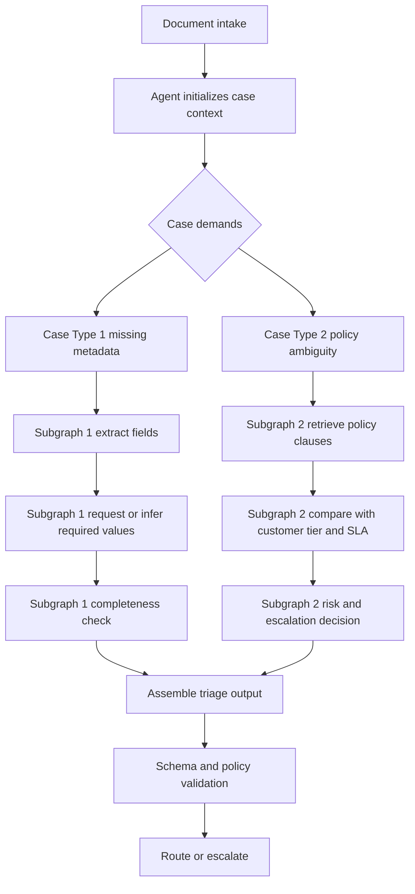

# Fieldnotes — Agents vs Workflows

## Finding 001: Core architectural distinction
**Option A uses a fixed control graph; Option B uses a partially dynamic control graph.**

This is the first and most important framing for the experiment.

- **Option A (workflow-constrained):** control flow is predefined and deterministic (with bounded retries).
- **Option B (agentic):** control flow can branch at runtime based on case context and tool outcomes.

At design/build stage, this becomes the key distinction to preserve and measure.

## Why this matters
- It changes how we reason about reliability, testing, and governance.
- It changes how we reason about adaptivity on ambiguous documents.
- It changes where complexity lives: orchestration code (A) vs runtime policy/guardrails (B).

## Human-role analogy
A useful analogy is two types of human triage roles:

- **Rote triage operator (A-like):** follows a strict checklist in a fixed order and escalates when inputs do not fit.
- **Empowered triage analyst (B-like):** chooses what evidence to gather next, consults references as needed, then makes a recommendation under policy constraints.

Both can produce high-quality outcomes; they differ in flexibility, supervision burden, and failure modes.

## Brief pros and cons

### Option A (fixed graph)
**Pros**
- predictable execution and easier testing
- simpler operational controls
- strong auditability of path taken

**Cons**
- less adaptive on novel/mixed inputs
- can require prompt/rule maintenance churn
- may miss context that a dynamic evidence-gathering loop could catch

### Option B (dynamic graph)
**Pros**
- adaptive evidence gathering and tool selection
- better handling of ambiguous/edge cases
- potential quality lift on complex documents

**Cons**
- higher control-plane complexity
- harder to bound latency/cost without strict caps
- broader safety and observability burden

## Case-dependent subgraphs in Option B
The agent does not run one universal checklist for every document.
It behaves like a capable triage analyst who asks, "What is missing in this case?" and then chooses the next best action.
Different case types trigger different mini-workflows (subgraphs), while still converging to the same final validation and routing step.

Consider two tickets arriving back-to-back:

**Ticket 1 (incomplete incident report)**
> "Production API latency doubled after 14:00 UTC. Impacting EU users."
>
> Attached fields: `region=EU`, `service=api-gateway`
>
> Missing fields: `customer_tier`, `incident_start_time`, `request_id examples`

For this case, the agent's best move is a **metadata completion subgraph**:
- extract what is present
- infer what can be inferred safely
- flag/request what cannot be inferred
- only then finalize triage

**Ticket 2 (policy ambiguity)**
> "Please grant temporary admin access to external contractor for overnight migration."
>
> Customer says change window is approved, but account is in a regulated environment.

For this case, the agent should run a **policy interpretation subgraph**:
- retrieve access-control and exception policy
- cross-check customer tier/regulatory flags
- determine escalation requirement before routing

Both tickets are "triage," but the right intermediate steps are clearly different.

The diagram shows exactly how these case-specific paths diverge and re-converge.
This is the operational behavior to measure against Option A during build and evaluation.

## Design and build implication
For implementation, shared components should remain constant (schema, validators, policy checks, metrics), while only the orchestration behavior differs between A and B.

That keeps comparisons fair and makes this finding testable.
